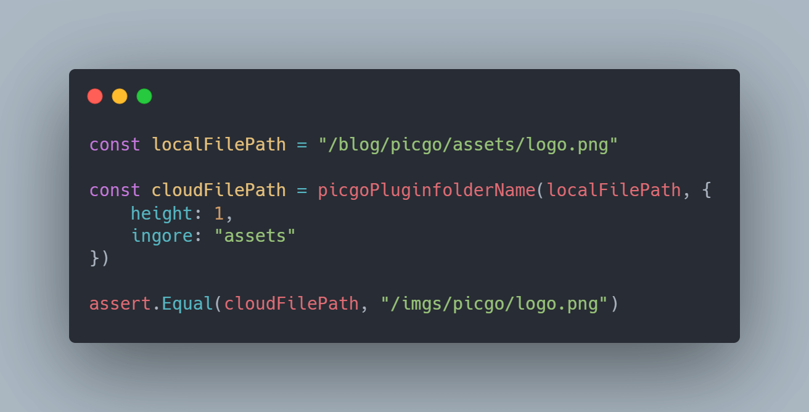

## picgo-plugin-folder-name

[](https://npm.js)  [](<https://www.npmjs.com/package/picgo-plugin-folder-name> ) [](https://github.com/evgo2017/picgo-plugin-folder-name)

Use part of the local address of the file as part of the cloud address.

将文件的部分本地地址，作为部分云端地址。便于分文件夹管理文件。

## 一、示例

本地文件地址为 `/blog/picgo/assets/logo.png` ，则通过配置，云端地址可为 `/imgs/picgo/logo.png`。其中 `imgs` 是 `uploader` 的自定义图床存储路径， `picgo` 是文章名称。

将文件的父文件夹名称 `picgo` **自动设置**为一层地址，并忽略 `assets` 这一层。



> 开发此插件起始原因：
>
> 使用 Typora 书写 Markdown 文章，配置好图片上传服务后，移入的图片会通过 PicGo 自动上传至云端，地址随后改为云端地址。
>
> 我的每篇文章为独立文件夹，内部 `index.md` 为主内容，`assets` 用来存放图片。为了便于管理每一篇文章图片，需要对应文章的图片在对应的文件夹下，自己不想每次手动配置存储路径，所以开发了此插件。

## 二、安装

### 1. 命令行 CLI

```
picgo install folder-name
```

### 2. 界面 GUI

在 PicGo 插件设置内搜索 `folder-name`

### 3. 离线安装

命令行或者界面均可这样离线安装，会在对应 `node_modules` 内建立一个快捷方式到克隆的项目内。

需要注意 `npm` 命令的调用位置，[CLI 存储地址](https://picgo.github.io/PicGo-Core-Doc/zh/guide/config.html#默认配置文件)与 [GUI 存储地址](https://picgo.github.io/PicGo-Doc/zh/guide/config.html)不同。

```
git clone https://github.com/evgo2017/picgo-plugin-folder-name
// 到对应安装目录
npm install [clone后的本地项目地址]
```

## 三、配置

### 1. 配置项

| 配置项 | 类型   | 含义                       | 默认值 | 示例          |
| ------ | ------ | -------------------------- | ------ | ------------- |
| height | Number | 向上层数，包含几层父文件夹 | 1      | 0             |
| ignore | String | 忽略名称，空格隔开多个名称 | ""     | assets public |

###  2. 详细解释

若文件路径中某文件夹的名称，存在于 `ignore` 配置项中，则会自动忽略，并不加入 `height` 层数的计算，可查看示例。

若 `height` 为 0，则不会包含其父文件夹名称，插件此时不进行任何操作。

### 3. 修改配置

#### ① 命令行修改

```
picgo set folder-name
```

#### ② GUI 修改

在 PicGo 的插件设置中，点击此插件的右下角，选择`配置plugin - folder-name`即可，可参考[插件设置](https://picgo.github.io/PicGo-Doc/zh/guide/config.html#配置)。

#### ③ 配置文件

修改配置文件。

```json
"picgoPlugins": {
  "picgo-plugin-folder-name": true
},
"picgo-plugin-folder-name": {
  "height": "1",
  "ignore": "assets"
}
```

## 四、最后

若有问题，请先查阅以下相关文档，最后欢迎提 [issues](https://github.com/evgo2017/picgo-plugin-folder-name/issues)

* [PicGo-Core 文档](https://picgo.github.io/PicGo-Core-Doc/zh/)

* [PicGo](https://picgo.github.io/PicGo-Doc/)

* [插件搜集](https://github.com/PicGo/Awesome-PicGo)

MIT © Evgo2017